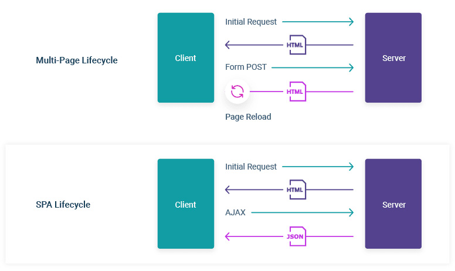

# AJAX

## Resources

 - code repo: https://github.com/muyiwaoyeniyi/lhl-lectures/Jan-24th-2022-Cohort/tree/main/flex-m04w8d3
 - video: https://vimeo.com/691218666/b8e6d537b5

---

### Content
- [X] MPA/SPA Recap
- [X] AJAX
- [X] Demo: XMLHttpRequest (XHR)
- [X] Demo: AJAX jQuery Intro with API
- [X] Some considerations
---


## MPA/SPA Recap



## AJAX

  Asynchronous JavaScript and XML

```xml
<user>
  <name>idb</name>
  <password>1234</password>
</user>
```
```json
{
  "name": "idb",
  "password": "1234"
}
```
    Invented by Microsoft for Outlook Web Access as a way of replicating desktop application functionality in the browser
    Thanks to AJAX, web applications can send and receive data asynchronously without requiring a browser refresh
    The widespread use of AJAX was one of the factors that led to Web 2.0
    Originally retrieved data sent using XML, but modern applications use JSON instead

## XMLHttpRequest Object

    AJAX is implemented using the XMLHttpRequest (XHR) object
    Modern libraries (such as jQuery or axios) provide us with easy-to-use wrappers for the XHR object

## AJAX: Real World Example
* Load More Recipes: https://www.allrecipes.com/recipes/16376/healthy-recipes/lunches/
* Load More Tweets on Scroll: https://twitter.com/home
* `XMLHTTPRequest` sends a request to a web server.
* New **tweets** or **recipes** will be loaded without page being refreshed.
* **Dev Tools**: Network > Fetch/XHR to check for the `requests`.

---


## Demo: AJAX with XHR
* `AJAX` uses `JavaScript's` `XMLHTTPRequest` object in order to make `HTTP` requests behind the scenes.
* `jQuery` abstracts all this to us with only a few lines of code.

```javascript
    const showCountries = () => {
      let xhr = new XMLHttpRequest();

      xhr.open('GET', 'https://restcountries.eu/rest/v2/all', true);

      xhr.onload = function() {
        if(xhr.status === 200) {
          const countries = JSON.parse(this.response);
          countries.forEach(country => {
            const countryCard = document.createElement('div');
            const countryFlag = document.createElement('img');

            countryCard.innerHTML = country.name;
            countryFlag.src = country.flag;

            countryCard.appendChild(countryFlag)
            document.getElementById('feed').appendChild(countryCard);
          });
        }
      }

      xhr.send();
    };
```
---


## jQuery AJAX

jQuery gives us an API for making AJAX requests
```js
$.ajax({
  url: 'https://jsonplaceholder.typicode.com/posts',
  method: 'GET',
  dataType: 'json',
  success: (data) => {
    console.log('this request succeeded and here\'s the data', data);
  },
  error: (error) => {
    console.log('this request failed and this was the error', error);
  }
});
```
## jQuery Shorthand Methods

jQuery has several shorthand methods so that we don't have to use the full .ajax method every time
```js
// make a get request to the specified endpoint
$.get('https://jsonplaceholder.typicode.com/posts');

// make a get request for JSON data
$.getJSON('https://jsonplaceholder.typicode.com/posts');

// make a post request
$.post('https://jsonplaceholder.typicode.com/posts', { /* form data */ });
```

## Some considerations

- Browser history and how it remains unaffected (pros/cons)
- When does it make sense to use AJAX (perceived performance, not just SPAs)
- Should we assume JS is turned on or have fallbacks to things like AJAX? (This is mostly opinion / speculation but worth a 2m convo)
- Response types - JSON, rendered HTML, JS
- CORS

## Useful Links

 - [Blog post coining AJAX](https://web.archive.org/web/20160305044414/http://adaptivepath.org/ideas/ajax-new-approach-web-applications/)
 - [Wikipedia: AJAX](https://web.archive.org/web/20160305044414/http://adaptivepath.org/ideas/ajax-new-approach-web-applications/)
 - [MDN: XMLHttpRequest (XHR)](https://web.archive.org/web/20160305044414/http://adaptivepath.org/ideas/ajax-new-approach-web-applications/)
 - [jQuery AJAX, getJSON, and post methods](https://web.archive.org/web/20160305044414/http://adaptivepath.org/ideas/ajax-new-approach-web-applications/)
